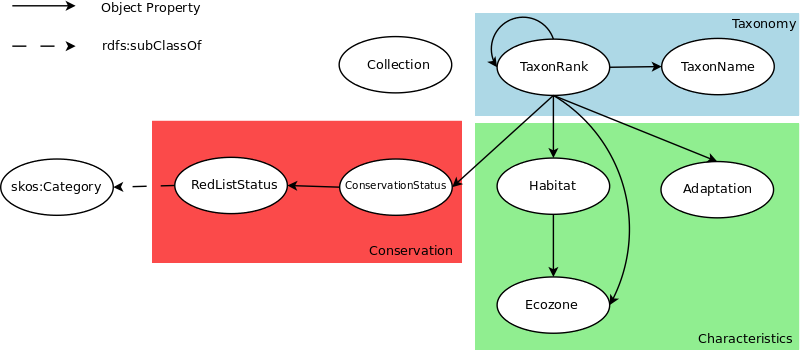

# BBC Wildlife Ontology

This repository is an independent archival copy of the **BBC Wildlife Ontology**, originally developed for the BBC Wildlife Finder project.

The ontology is a lightweight vocabulary for publishing data about biological taxa, including their taxonomy, habitats, adaptations, behaviour and conservation status. It was designed to support Linked Data published by BBC Wildlife Finder while remaining interoperable with more specialised biological vocabularies.

The ontology was developed by **Tom Scott** and **Leigh Dodds** and first published by the BBC in 2010. The archived ontology in this repository is **version 1.1**, dated 18 December 2013.

## Status

This is an **unofficial archival copy**. It is not an official BBC repository and the ontology is not actively maintained here. The purpose of this repository is preservation: the ontology itself has not been modernised, corrected or given a new namespace.

The historic namespace remains:

`http://purl.org/ontology/wo/`

The original BBC documentation was published at:

`https://www.bbc.co.uk/ontologies/wildlife`

A preserved documentation copy is also available from the International Press Telecommunications Council (IPTC):

`https://iptc.org/thirdparty/bbc-ontologies/wo.html`

The ontology is also catalogued by Linked Open Vocabularies:

`https://lov.linkeddata.es/dataset/lov/vocabs/wlo`

## Files

- [`wildlife-ontology-1.1.ttl`](wildlife-ontology-1.1.ttl) — the preserved version 1.1 ontology in Turtle.
- [`wo.png`](wo.png) — an image of the original BBC Wildlife Ontology documentation.
- [`LICENSE.md`](LICENSE.md) — copyright, licence and archival provenance information.

## Provenance

The version preserved here identifies itself as Wildlife Ontology 1.1, with a creation date of 4 January 2010 and version date of 18 December 2013. It names Tom Scott and Leigh Dodds as its creators and records the original BBC internal canonical location.

The ontology file preserved here matches public archival copies of version 1.1, including independent GitHub preservation copies. No semantic changes have been made.

For contemporary context, the ontology was announced to the Linking Open Data community in February 2010 alongside the BBC Wildlife Finder RDF publication.

## Copyright and licence

Copyright © 2010 British Broadcasting Corporation.

The Wildlife Ontology and its accompanying RDF documentation were published under a Creative Commons Attribution licence. See [`LICENSE.md`](LICENSE.md) for details.
